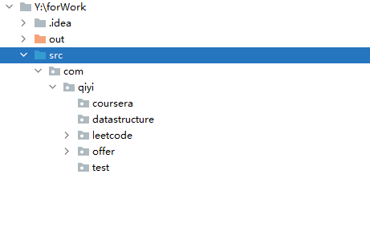

## forWork
---
### just some tests
1. 从今天开始刷题
2. 记录相关体会和tips
3. 让我们一起加油吧~
4. 项目目录暂时如下：
   - coursera为数据结构课上的习题
   - datastructure为尚硅谷老韩的java数据结构源码复现
   - leetcode为leetcode题库
   - offer为剑指offer题库
   - test为理解日常java函数以及源码创建的demo
   
   